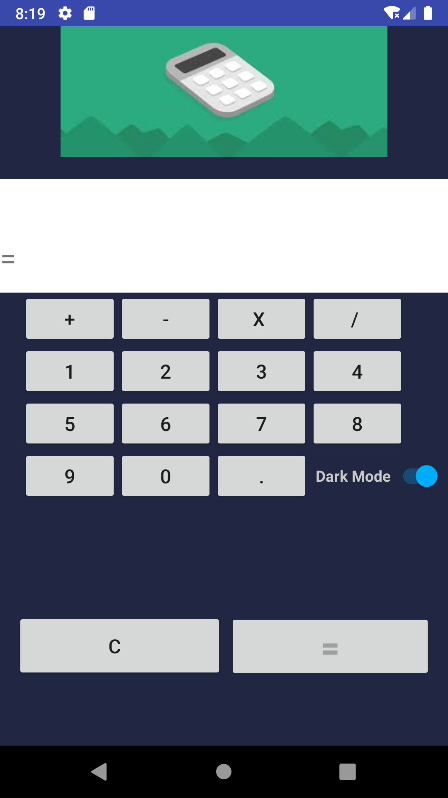
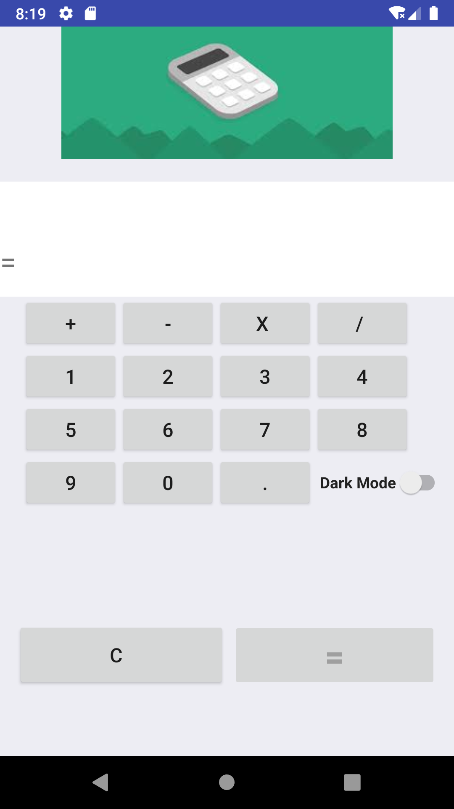

# Simple-Calculator
A simple Java based Calculator app made in Android Studio 4.0, Canary Build. It has the simple arithmetic capabilities with basic functionality and responsive UI. Now with a Beta stage Dark-Mode Updated.

# How to use ?
Download/clone the repository and open in Android Studio to customize any details.

# License : 
Feel free to optimize my code and customize it.

# Screenshots :

